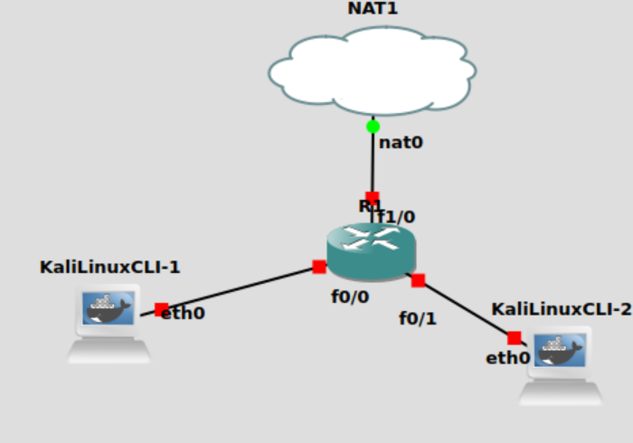
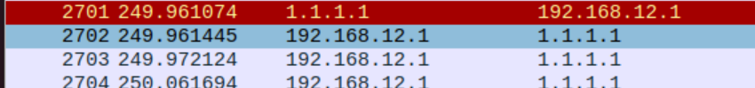

# Members
* Alexandro Joe Claudio (2501963160) L4AC
* Jonathan Prasetyo (2501982613) L4AC
* Joshua Alexander Silalahi (2502005244) L4AC
<br>
<br>

# What is ACK Flag Probe?
Refer to this docs:
[ACK Flag Probe pdf](https://github.com/steph45607/Eth_Scan/blob/main/ACK_FlagProbe/ACK_FlagProbe.pdf)

<br>
<br>

# Testing

## 1. GNS3 Installation
Install GNS3 in your Ubuntu virtual link using the link below:
<br>
https://staniswinata.notion.site/GNS3-Installation-on-Ubuntu-22-04-21556bbde7224b20825714f50cd085d9
<br>
This is needed to perform the testbed for trying out the NMAP.
<br>
<br>

## 2. Creating the TestBed for the Project
### Create the Project
Open GNS3, from there create a new project. This can be done by clicking on 
<br>
“File” → “New Blank Project”

### Adding Devices to The New Project
You can drag and drop the devices that you wish to connect using the GNS3 main workspace.

### Device Connection
Insert the devices that will be used using the drag and drop method from the device menu.
here are the lists of devices that are required for this project:
* 2 Kali Linux CLI 
* 1 NAT
* 1 Router
<br>

### Save the Settings and Run the TestBed
As soon as you finish setting up and configuring the devices in your testbed you can save the project. You can start the simulation as well by clicking the play button. 
<br>

### Recheck the Connectivity
You can verify and check the connection between the devices. This can be done by pinging the devices by its IP address. 
<br>
<br>

## 3. Testing out the Nmap vs Iptables
Download Nmap Commands:
```
$ sudo apt install nmap
```
Download Iptables Commands:
```
$ sudo apt-get install iptables 
```
Using the ACK FlagProbe with Nmap:
```
nmap -sA -T4 <ip address>
```
Using the Iptables to prevent the ACK FlagProbe:
```
iptables  -A INPUT -p tcp --tcp-flags ACK ACK -j DROP
```
<br>
<br>

# Docummentation
## Topology:

## Topology:

