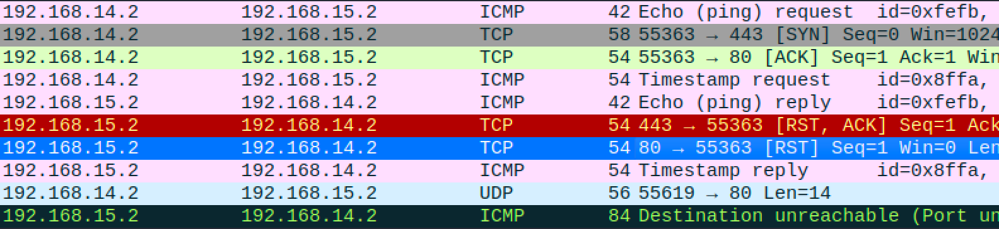

# UDP Scanning

For testbed, please check this:
[Testbed tutorial](testbed.md)

We can say that the UDP Scan is a success if we got a response if the port is open or closed. Looking from the wireshark

## UDP scan with Nmap
To do UDP Scan with nmap, use this command
where `-sU` means the type of scan, which is UDP scan
```
nmap -sU <ip>
```
or, you can also do this, if you want to scan a specific port
```
nmap -sU -p <port> <ip>
```


form the picture, you can see that the attacker got an ICMP response of desitnation unreachable

## Iptables prevention
iptables enables us to declien every UDP packet send and it will not return any to the attacker.

Therefore we `DROP` the UDPs. This will result in a silent drop where no response will be sent to notify.


```
iptables -A INPUT -p udp -j DROP
```


---

If you want to reset the machine, from the rules from iptables.

Run these code below to flush and clean all chains.
```
iptables -F
iptables -X
```