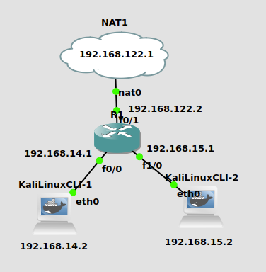
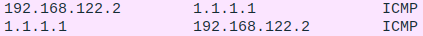

# How to make the testbed
For GNS3 installation please follow this (Ubuntu and Kali):
https://staniswinata.notion.site/GNS3-Installation-on-Ubuntu-22-04-21556bbde7224b20825714f50cd085d9



## 1. Open GNS3
What you need to make this testbed are:
- 1 NAT
- 1 ROUTER
- 2 Kali Linux CLI

if you are unable to do NAT (you have some error with libvir).

Do this:

``` plain
sudo nano /tmp/default.xml
```

and paste this inside
```
<network>
  <name>default</name>
  <bridge name="virbr0"/>
  <forward mode="nat"/>
  <ip address="192.168.122.1" netmask="255.255.255.0">
    <dhcp>
      <range start="192.168.122.2" end="192.168.122.254"/>
    </dhcp>
  </ip>
</network>
```
and run this
```
virsh net-define /tmp/default.xml
sudo virsh net-start default
sudo virsh net-autostart default
```
source: https://www.tutorialjaringan.com/2020/02/cara-mengatasi-error-while-creating-node-from-template-di-gns3.html
## 2. Make em look like the picture above, connnect them all
- NAT nat0 connect to Router (R1) using interface f0/1
- Kali1 eth0 connect to R1 using interface f0/0
- Kali2 eth0 connect to R1 using interface f1/0

## 3. Start with connecting the router to NAT
You want to check your virbr0 ip in your device, you can do 
`ip a` or `ifconfig`

then you can get your virbr0 ip.

then in your **router CLI**
```
config t
interface f0/1
ip add <same ip with virbr0 with .2> 255.255.255.0
no shut
end

show ip interface brief
show ip route

config t
ip route 0.0.0.0 0.0.0.0 <virbr0 ip .1>
end

show ip route 
ping 1.1.1.1
```

`show ip interface brief` is to check if you have inputed the right IP to the right interface, it's a table of interface and their IP

if you got it wrong do this
```
interface <interface>
no ip add
do wr
```
 ## 4. Connect Kali to router
 Now to connect your Kali to the router, you have to
 - Create an IP
 - "register" the IP to the router
 - add the default route so you can connect to the internet
 - configure NAT inside outside access-list table, so it would look like we connect to the internet from the router not from kali

In your **router CLI**
```
config t
interface <interface of Kali>
ip add <new ip with diff subnet .1, lets call this kaliIP> 255.255.255.0
no shut
end
```
In your **Kali CLI**
```
ip add a <kaliIP.2>
ping <kaliIP.1> 
# this is not supposed to work
ping 1.1.1.1

# check the routing table
ip route show
ip route add default via <kaliIP.1> dev <Kali Inteface>
# now they can connect, but it's not sending anything
```
you want to do this from your **router CLI**
```
config t
interface <router interface of your kali>
ip nat inside

interface <router interface for NAT>
ip nat outside
exit

# made the table and you want to attach it to an interface
access-list 100 permit ip any any
ip nat inside source list 100 interface <NAT Interface> overload
end

# you can see hits from here
show ip nat statistics
```

try to `ping 1.1.1.1` from your Kali while you have your wireshark open, you can see that it's actually requesting from the router IP not the Kali's IP


---
Note:

Do not assign IP that ends with 0 (example: 192.168.14.0)

Because IP with 0 endings are assigned for network address or default gateway. It is not suitable for end device, usually it's used for routers.